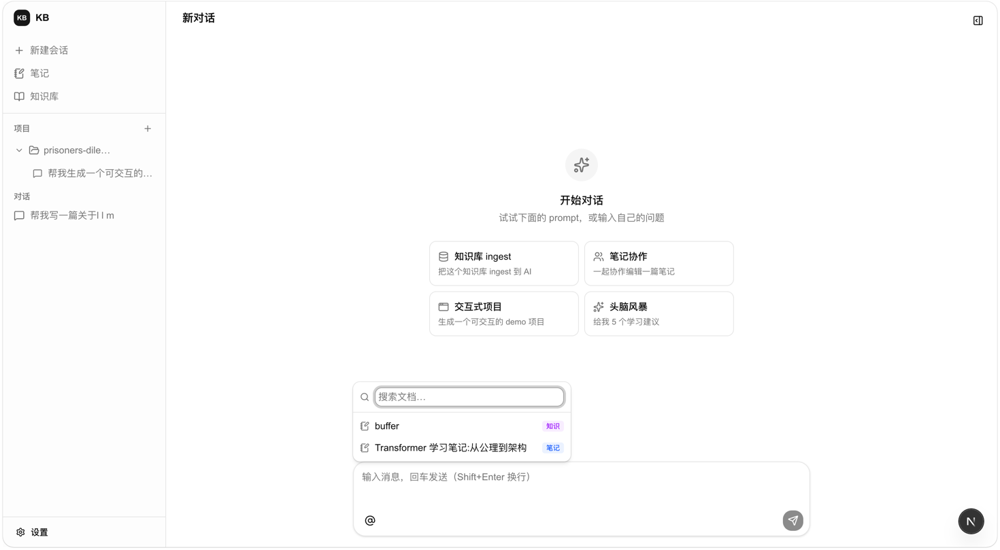
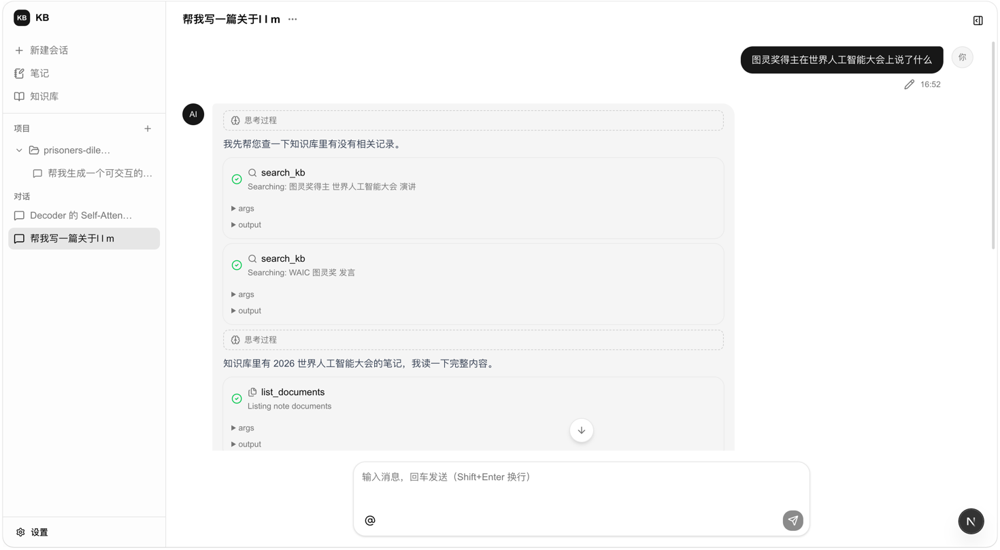
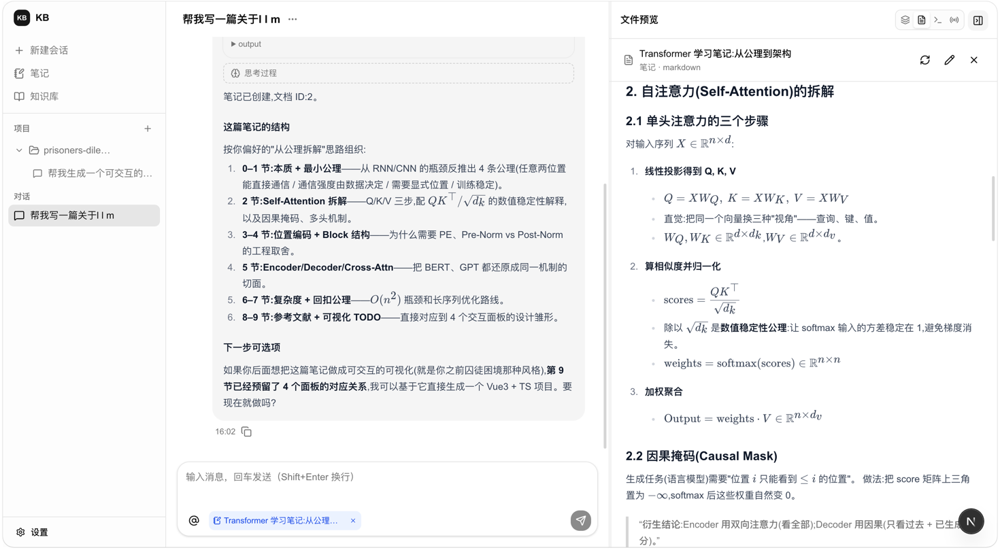
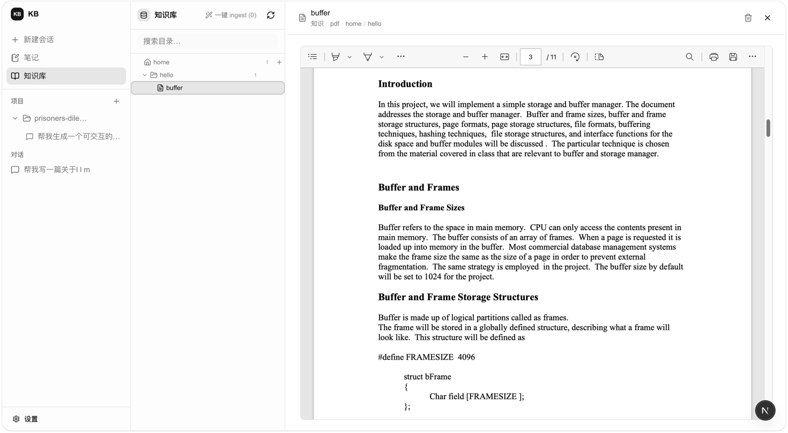
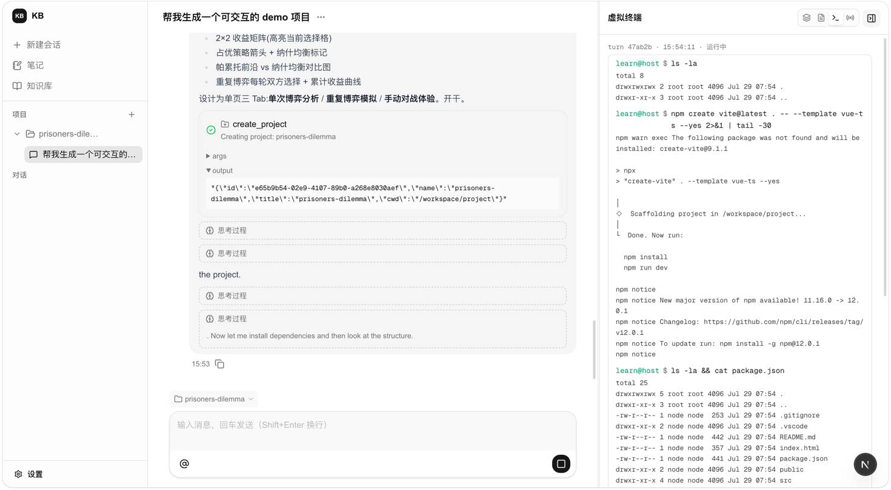
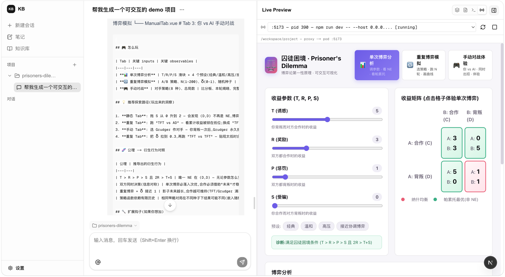

# KB

> 带 RAG / 工具调用 / K8s 沙箱的个人知识库 + Chat 后端。


## 📸 截图

<p style="text-align:center">
  
  
  
</p>
<p style="text-align:center">
  <em>主界面：空对话 prompt</em>
  &nbsp;&nbsp;&nbsp;&nbsp;
  <em>RAG 召回：<code>search_kb</code> 工具调用</em>
  &nbsp;&nbsp;&nbsp;&nbsp;
  <em>笔记协作：编辑笔记 + 侧栏预览</em>
</p>

<p style="text-align:center">
  
  
  
</p>
<p style="text-align:center">
  <em>知识库：树形目录 + 文件预览</em>
  &nbsp;&nbsp;&nbsp;&nbsp;
  <em>沙箱终端：sandbox pod 终端</em>
  &nbsp;&nbsp;&nbsp;&nbsp;
  <em>交互式学习：dev server iframe</em>
</p>

## ✨ 特性

- 🤖 **多轮 Chat + 流式输出**：SSE 实时推 token,Redis Stream 持久化,断线可 Replay
- 🔍 **Hybrid RAG**：dense (pgvector) + sparse 召回,LLM rerank,top-k 注入 prompt
- 🛠️ **Tool Calling**：bash / project / document / retrieve / ask_user / write_memory / skill_loader
- 📦 **双源文档**：`note` 可编辑、`knowledge` PDF + 树形目录,worker 周期 ingest
- 🏗️ **K8s Sandbox**：会话级沙箱 + Agent-Sandbox-Controller 调度,bucket 持久化 

## 🏛️ 架构

```
                          ┌─────────────────────────────────────┐
                          │           Next.js (web)             │
                          │  Chat UI / Tree / iframe Preview    │
                          └────────────┬────────────────────────┘
                                       │  /api/v1 (SSE)
                          ┌────────────▼────────────────────────┐
                          │   interfaces/http  (Gin + OTel)     │
                          │   Auth / Handler / DTO / SSE Writer │
                          └────────────┬────────────────────────┘
                                       │
                          ┌────────────▼────────────────────────┐
                          │        application/                 │
                          │  User / Auth / Conversation         │
                          │  Document / Project (用例编排)        │
                          └────────────┬────────────────────────┘
                                       │
                          ┌────────────▼────────────────────────┐
                          │          domain/                    │
                          │  Entity / Repo Interface / Error    │
                          │      (zero external deps)           │
                          └────────────┬────────────────────────┘
                                       │
   ┌──────────────┬──────────────┬─────┴────┬──────────────┬──────────────┐
   │              │              │          │              │              │
┌──▼──┐      ┌────▼────┐    ┌────▼────┐ ┌───▼────┐   ┌────▼────┐    ┌────▼────┐
│ PG  │      │  Redis  │    │  MinIO  │ │ Neo4j  │   │   K8s   │    │  LLM    │
│ vec │      │ Stream  │    │   S3    │ │  Graph │   │ Sandbox │    │  /Emb   │
│ tor │      │  Cache  │    │  Obj    │ │        │   │   Pod   │    │  API    │
└─────┘      └─────────┘    └─────────┘ └────────┘   └─────────┘    └─────────┘
```

依赖方向: `Interface → Application → Domain`、`Application → Infrastructure` 实现 `Domain` 仓储接口。

## 🚀 快速开始

### 前置

- Go 1.26+
- Node 20+ / pnpm
- Docker + Docker Compose
- `kubectl` + minikube (sandbox 用)

### 本地开发

```bash
# 0. 复制环境变量模板并按需填值
cp .env.example .env

# 1. 拉起依赖 (postgres / redis / minio / otel-lgtm)
make up

# 2. 拉起 minikube
make minikube-up

# 3. 安装 Agent-Sandbox-Controller
git clone https://github.com/resplendid123/Agent-Sandbox-Controller.git
cd Agent-Sandbox-Controller && make deploy

# 4. 起后端
make backend

# 5. 起前端
make frontend
```

## 📁 项目结构

```
cmd/server/                         入口 (Composition Root + Worker)
internal/
  interfaces/http/                  HTTP 层 (Gin) → Application
  application/                      用例编排
    auth/  user/  conversation/  document/  project/
  domain/                           实体、仓储接口、领域服务
    auth/  user/  conversation/  document/  project/  s3/
  infra/                            实现
    database/  data/  cache/  s3/  sandbox/  auth/  ai/  ...
web/                                Next.js 前端
deploy/grafana/                     OTel LGTM 监控相关 manifests(与沙箱无关)
configs/                            配置文件
```

## 🛠️ 常用命令

| 命令                          | 作用                            |
|-------------------------------|---------------------------------|
| `make up` / `make down`       | 起停 docker-compose 依赖        |
| `make backend`                | air 热重载后端                  |
| `make frontend`               | 起前端 dev server               |
| `make build`                  | 编译 `cmd/server` 到 `tmp/main` |
| `make minikube-up` / `make minikube-down` | 起停本地 k8s 集群   |

Sandbox pod 的 exec / 日志直接 `kubectl -n sandbox-u-<uid> ...`,详见 `docs/sandbox.md` §10。

## 📜 License

[MIT](./LICENSE)
